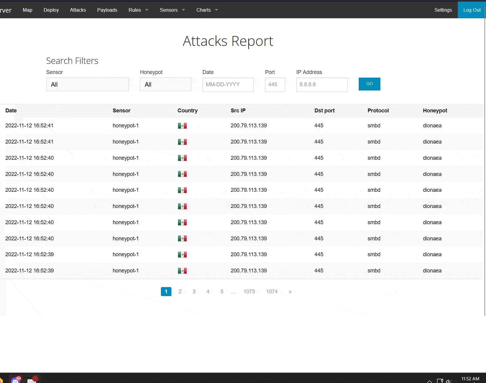
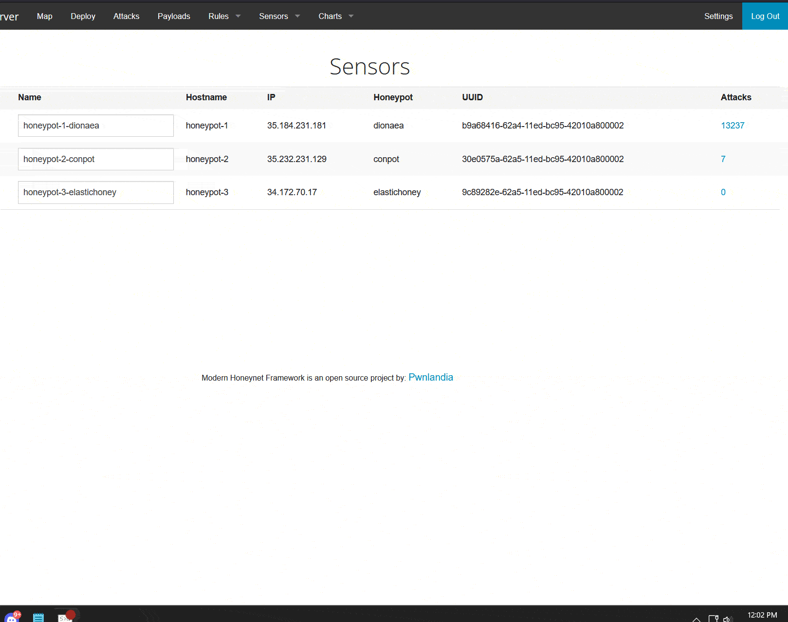
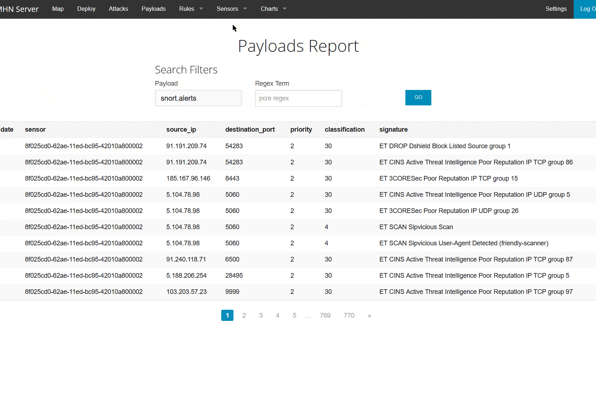

# Honeypot Assignment

**Time spent:** **6** hours spent in total

**Objective:** Create a honeynet using MHN-Admin. Present your findings as if you were requested to give a brief report of the current state of Internet security. Assume that your audience is a current employer who is questioning why the company should allocate anymore resources to the IT security team.

### MHN-Admin Deployment (Required)

**Summary:** I deployed the MHN-Admin panel onto a VM on Google Cloud, using the Google Cloud SDK. As you can see, it is deployed and is seeing a lot of activity. I first had to set up a VM with Ubunutu and then run the script that installed all of the dependencies, libraries, and code that built the honeypot. I also had to ensure the VM had ports 10000 and 3000 open so it can receive data from the sensor honeypots.

### Dionaea Honeypot Deployment (Required)

**Summary:** Dionaea is intentionally vulnerable and attracts attackers to investiage potential exploits in the "server". It allows exploitation within the controlled environment to give attackers the impression they are doing damage, however, it actually tracks their IP and sends it to the MHN admin server so a security researcher can view their actions and better understand what ports they are targeting, the protocols they are attempting to exploit, and malware they are using. As we can see in the GIF, an IP from Mexico is attempting to exploit the server via SMBD protocol, which is commonly used for file sharing across windows networks.

### Database Backup (Required) 

**Summary:** The MHN admin uses mongodb to store information on attacks. I downloaded the json file several days after setting up the honeypots, so the entire contents are quite large. 

*See repository for JSON file*

### Deploying Additional Honeypot(s) (Optional)

#### Conpot Honeypot

**Summary:** This honeypot simulates an Industrial Control System and allows security researchers to better understand attacker's techniques when targeting these sorts of systems. As the GIF shows us below, a couple different IP addresses were investigating port 502 with the modbus and s7comm protocols (protocols that are used in ICSs) as well as the http protocol. 

### Malware Capture and Identification (Optional)

#### WannaCry Malware

**Summary:** My Dionaea honeypot captured several strains of WannaCry Malware, a popular malware strain that exploited the Eternal Blue vulnerability developed by the National Security Administration. Dionaea provides attackers with the temptation to exploit the SMB protocol vulnerability, which explains why we saw so much interest in the port with SMBD

MD5 Hash: * a4d49eaf60a8e333708469606ad9e1a4*

SHA1 Hash: * 0debce6791059e239af3bc6ab42c1605c4a03937*

## Notes
I had to restart the challenge from the begining because I originally used my .edu address to build the project, but my organization's permissons settings disallowed me from adding the tags I needed to get the honeypot sensors communicating with the admin panel. I knew they were getting traffic because when I SSHed into them, the logs showed a bunch of IP addresses.
